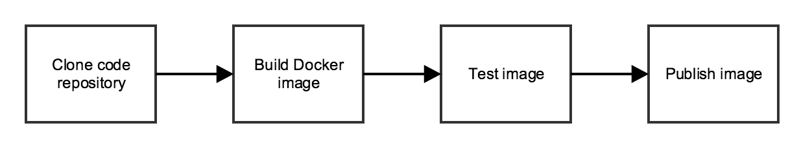

## Follow step

### 1. Code application

### 2. Writing a Dockerfile

### 3. Building the image locally

```
docker build . -t name_image:v1
```

#### Running the image locally

```
docker run -d -it -p 3000:3000 name_image:v1
```

#### Check if the server responds in your local port 3000

```
curl http://127.0.0.1:3000
```

### 4: Building the image in Jenkins

Docker image can be built, we’ll want to do it automatically every time there is a change to the application code.

#### Pipelines as code: The Jenkinsfile

Build project using docker (Dockerfile)

Deploy project using jenkins (Jenkinsfile)



Write a Jenkins Pipeline specification in a Jenkinsfile.

Now, we’ll just need to tell Jenkins two things:

1. Where to find our code
2. What credentials to use to publish the Docker image

#### Configuring Docker Hub with Jenkins

## Start jenkins

```
docker run -it -d --name myjenkins -p 8080:8080 -p 50000:50000 -v /var/jenkins_home jenkins/jenkins
```

Reference: https://tutorials.releaseworksacademy.com/learn/building-your-first-docker-image-with-jenkins-2-guide-for-developers
